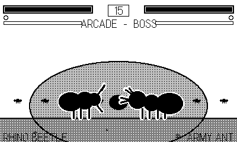

# Fightin' Chitin

> Part of **[plAIdate](https://plaidate.github.io)** — AI-built 1-bit games, ports, and engines for the Playdate.

A one-on-one 2D fighting game for the Playdate, starring the insect world's
real brawlers. Two attack buttons keep it approachable; motion inputs and the
**crank** give it a deep special-move layer. Six fighters (plus an unlockable
boss), each a distinct archetype drawn from real behaviour, form a clean
rock-paper-scissors of grappler / rushdown / zoner. Single-player focused (the
Playdate has no second controller): an **Arcade ladder** with per-character
endings, plus Survival, Time Attack, Training and Versus.

Full design in [DESIGN.md](DESIGN.md); the player's manual — controls,
fighters, specials and systems — is [MANUAL.md](MANUAL.md).

## Play it

Open `Chitin.pdx` in the Playdate Simulator, or sideload it at
<https://play.date/account/sideload/>. To build from source, see
[Development](#development).

**Status: v1.0 — all five build phases complete.** Six fighters with
parametric-rig animation, motion-input specials, a crank-charged **Frenzy**
super, the **Molt** comeback, a **crank-flick parry**, six habitat stages with
their own chiptune themes, an Arcade ladder that ends on the **Army Ant Major**
boss (beat it to unlock the Ant as a playable pick), and datastore save/unlocks.
Balance was tuned with an AI-vs-AI win-rate harness. *Combat feel and audio are
best judged on real hardware — that on-device tuning pass is the remaining
polish.*

## The fighters

| Fighter | Archetype | In a word |
|---|---|---|
| **Rhinoceros Beetle** | Grappler | Slow, armored, huge damage |
| **Leaf-footed Bug** | Technical grappler | Wrestles, counters, reflects |
| **Praying Mantis** | Rushdown | Fast glass cannon |
| **Tiger Beetle** | Speed | Fastest feet, mixups |
| **Dragonfly** | Aerial zoner | Actually flies |
| **Assassin Bug** | Zoner | Long reach + venom |
| **Army Ant Major** | Boss / unlock | Tougher; swarm super |

Balance triangle: grapplers beat zoners → zoners beat rushdown → rushdown beats
grapplers; the aerial and DoT fighters cut across it.

## Controls (at a glance)

- **✛ ←/→** walk (hold *away* = block) · double-tap = dash · **✛ ↓** crouch · **✛ ↑** jump
- **Ⓐ** light attack · **Ⓑ** heavy attack · **Ⓐ+Ⓑ** throw
- **Motion + attack** for specials: ↓↘→ (quarter-circle), →↓↘ (dragon-punch),
  charge back→forward, 360° for command grabs
- **Crank** — spin to charge **Frenzy**; at a full bar, ↓↘→ + Ⓐ+Ⓑ unleashes your
  **Super**. A fast crank *snap* just before a hit is a **parry**.
- **Molt** (double-tap ↓ + Ⓐ+Ⓑ at low health with a full bar) — shed your shell
  for a heal and a burst of teneral rage.

The full move list is in [MANUAL.md](MANUAL.md).

## Modes

**Arcade** (fight the ladder to your ending), **Survival**, **Time Attack**,
**Training**, **Versus**.

## Development

- `make` → `out/Chitin.pdx`; `make smoke` → instrumented build; `make balance`
  → the AI-vs-AI tuning build.
- `tools/smoke.sh [secs] [until-grep]` — headless Simulator run driven by an
  autopilot that tours the whole game (every fighter, specials, super, Molt,
  parry, the boss, all stages), with a heartbeat + first-error datastore and
  frame-stamped screenshots.
- `tools/balance.sh` — runs every matchup AI-vs-AI and prints a win-rate matrix.

Fighters are **parametric skeletal rigs** (procedural animation), not sprite
frames — so six distinct insects stay feasible in 1-bit.

MIT licensed — see [LICENSE](LICENSE).
